# Projeto da Disciplina - Especificação

Tema: Sistema de Arquivos Criptografado 🥷

> **Descrição do projeto**: o objetivo deste projeto é desenvolver um sistema de arquivos criptografado que permita armazenar arquivos de forma segura. O sistema deve utilizar uma estrutura de dados personalizada para armazenar os arquivos criptografados e garantir a confidencialidade e integridade dos dados.

O projeto deve abranger os seguintes tópicos:
1. Implementação de uma estrutura de dados para armazenar os arquivos criptografados. 
    * Pode ser uma árvore, lista encadeada, tabela hash ou qualquer outra estrutura adequada para o armazenamento seguro dos dados.
2. Utilização de algoritmos de criptografia e descriptografia para garantir a confidencialidade dos arquivos. 
3. Implementação de mecanismos de geração e armazenamento de chaves criptográficas para acesso aos arquivos.
4. Desenvolvimento de recursos para a manipulação de arquivos no sistema de arquivos criptografado.
    * Exemplos: busca, criação, leitura, gravação de arquivos.
5. Desenvolvimento de uma interface de linha de comando para interação com o sistema de arquivos criptografado.
    * Permitir a navegação pelos diretórios, visualização e manipulação dos arquivos protegidos.

A seguir cada um desses tópicos é descrito em detalhes

## 🏢 Estrutura para armazenamento de arquivos
Deve ser desenvolvida uma estrutura para armazenamento dos arquivos que farão parte do ambiente criptografado. Utilize como referência as sugestões de classes `Arquivo`, `Diretorio`, `ChaveCriptografia` e `SistemaArquivos` dispostas na figura a seguir:


## 🕋 Algoritmo de Criptografia
Para a criptografia do conteúdo dos arquivos, vamos utilizar a biblioteca [cryptocode](https://pypi.org/project/cryptocode/), que traz a implementação mais simples possível de criptografia, mas mantendo um bom nível de segurança.

Para instalar essa biblioteca, use o seguinte comando no terminal:
```bash
pip install cryptocode 
```

Em seguida, implemente esse exemplo em um arquivo Python:
```python
import cryptocode

chave = "423338233093093"
mensagem = "Esta eh a minha mensagem! :)"

mensagemCriptografada = cryptocode.encrypt(mensagem, chave)
print("Sua mensagem criptografada: " + mensagemCriptografada)

mensagemDescriptografada = cryptocode.decrypt(mensagemCriptografada, chave)
print("Sua mensagem descriptografada: " + mensagemDescriptografada)
```

O processo de criptografia e descriptografia utilizando cryptocode é simples. Basta utilizar o método `encrypt` com uma chave e a mensagem para criptografar, e o método `decrypt` com a mesma chave e a mensagem criptografada para obter a mensagem original.

## 🔑 Gerenciamento de chaves criptográficas
Ao criptografar dados sensíveis, eles são transformados em uma forma ilegível usando um algoritmo criptográfico e uma chave de criptografia. A chave é essencial para descriptografar os dados e torná-los legíveis novamente. No entanto, há situações em que é necessário descartar ou eliminar de forma segura os dados protegidos. Desta necessidade surge a importância do conceito deCrypto Shredding.

Crypto shredding, também conhecido como criptografia de destruição segura, é uma prática importante no campo da segurança da informação. Envolve o uso de criptografia para proteger dados sensíveis e, posteriormente, a revogação ou destruição das chaves de criptografia associadas a esses dados. Essa abordagem garante que os dados permaneçam confidenciais e inacessíveis, mesmo que um invasor obtenha acesso físico ou lógico aos dispositivos de armazenamento.

> No caso do projeto, ao armazenar cada arquivo, ele será gravado com a chave do seu detentor. Caso essa chave seja revogada, não será mais possível ter acesso ao conteúdo original do arquivo, o que caracterizaria a ação de Crypto Shredding.

Sendo assim, a chave utilizada é a `chave_criptografia` (da classe `SistemaArquivos`), que deve ser definida ou informada no início do programa. Caso essa chave não exista, será lançada uma exceção `ChaveCriptografiaInexistente`, indicando que não é possível gravar arquivos sem a chave. É importante ressaltar que a ChaveCriptografia possui uma validade. Se a chave for utilizada após a data de validade, deverá ser lançada uma exceção `ChaveCriptografiaExpirada` e o usuário terá a opção de revogar a chave e criar uma nova.

Em resumo, para esta etapa, deve ser possível: 
* Criar uma nova chave de criptografia que deverá ficar disponível durante a execução do programa. Ela deve ser verificada a cada ação de cifrar/decifrar arquivos.
* Revogar uma chave de criptografia criada anteriormente, o que irá impossibilitar o acesso original a quaisquer arquivos que tenham sido criados utilizando essa chave (Crypto shredding).

## 💻 Interface de linha de comando
A interface de linha de comando do programa esperado deve fornecer as seguintes opções:
* **Gerar Chave Criptografia**: gerar uma nova chave de criptografia no programa, o usuário poderá digitar livremente o conteúdo da chave a ser utilizada ou optar (exemplo: 123). A chave funcionará como espécie de senha para poder cifrar/decifrar os arquivos, mas ela terá uma data de expiração, perdendo a sua validade após essa data. 
* **Revogar chave criptografia**: apaga a referência para a chave criada anteriormente, forçando o usuário a gerar uma nova chave para armazenar novos arquivos posteriormente. Os arquivos que foram gravados com uma chave revogada não poderão mais ser decifrados (exceto se uma chave igual à usada anteriormente seja informada).
* **Gravar arquivo cifrado**: recebe os dados para construir um objeto do tipo Arquivo (includo o nome do diretório, que caso não exista, deverá ser criado) e armazena as informações do arquivo, que poderá ser localizado posteriormente através da navegação em um diretório ou da busca.
* **Listar Diretórios**: lista os nomes diretórios existentes e sua árvore de arquivos. Caso um sub-diretório seja fornecido, deverá exibir a árvore de diretórios daquele diretório em diante.
* **Buscar arquivos**: busca um conjunto de arquivos a partir de uma palavra-chave fornecida pelo usuário. Deve-se considerar na busca todos os diretórios (a partir da raiz), levando em consideração a correspondência com a palavra-chave.
* **Decifrar arquivos**: a partir do fornecimento do nome do diretório e o nome do arquivo, caso o arquivo exista, o sistema irá utilizar a chave de criptografia armazenada atualemnte para mostrar o conteúdo original do arquivo. 

## 🥡 Entregas Parciais do Projeto


| Entrega      | Data Limite     | Objetivos                                                                                                                                                          |
|--------------|-----------------|-------------------------------------------------------------------------------------------------------------------------------------------------------------------|
| ⚡️ Entrega 1    | 📅 19 de junho     | - Geração de chave de criptografia inicial<br>- Mecanismo de armazenamento de arquivos com criptografia do conteúdo<br>- Visualização hierárquica de diretórios/arquivos<br>- Mecanismo de decifrar arquivos armazenados anteriormente |
| ⚡️ Entrega 2    | 📅 10 de julho     | - Adição de mecanismo de revogação de chaves por expiração ou ação direta do usuário<br>- Verificação da validade da chave antes do uso e opção de sugestão de nova chave<br>- Busca de arquivos por palavras-chave                          |

## 🚀 Forma de Entrega e outras Informações
* Equipes de, no máximo, **04 (quatro)** alunos.
* O projeto corresponde à nota da **3ª Avaliação**;
* Os projetos serão defendidos em data definida no calendário da disciplina. Os membros da equipe serão sabatinados sobre o código. A nota de cada aluno pode ser diferenciada, dependendo do grau de participação/conhecimento de cada aluno na elaboração do projeto.
* O código pode ser implementado usando qualquer ferramenta.
* Os arquivos correspondentes ao projeto devem ser entregues no prazo de cada data prevista.
* Os códigos enviados com atraso terão uma redução automática de 20% do total de pontos equivalente à etapa do projeto.
* A entrega poderá ser feita através de um arquivo compactado (zip) contendo os arquivos do projeto ou da disponibilização de um link em um repositório on-line de controle de versões (ex.: Github).